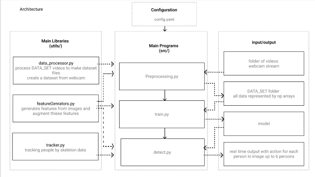

# Real Time Action Detection For Multiple People Using PoseEstimation

Perform Action detection for multiple people in real time by using MoveNet lightning to get up to 6  people keypoints and feed their saved movements to LSTM neural network.

This Project was created for my graduation project at Damascus university to perform cheating detection for ICDL Exams in Syria.

Future Plans:
1. improve Tracker algorithm to output more accurate results 
2. try to find more accurate poseEstimation models for multiple people


## DATA_SET
There are two ways of collecting dataset :
1. Get Videos of fixed length (2 seconds for example) from internet and save them into some floder of your choise
   EX : [UCF50 - Action Recognition Data Set](https://www.crcv.ucf.edu/data/UCF50)
   to create dataset from this videos as NumPy arrays please type the following command in terminal
   `python src/preprocessing.py --input your_videos_folder`
   
2. film yourself using webcam by executing this code in terminal
    `python src/preprocessing.py`
   in this way dataset will be created automatically as folders of NumPy arrays

Sometimes PoseEstimation Model can't get enough keypoints from video in dataset so it is better to remove videos like that to make model output more accurate, to do that you can type:
    `python src/preprocessing.py --input videos_folder --del_nonUsed True  `


## detection pipeline 


pipeline steps:
1. input Video frame to MoveNet lightning model
2. input extracted keypoints to Tracker Algorithm
3. get tracker output and for each person save the current skeleton
4. iterate through first 3 steps until each person movements are saved in  list with length = to input sequence length of LSTM neural network
5. input each person sequence to LSTM model 
6. get output for each person and display it on next frame of video 
7. repeat this operation until video is finished
   

## project architecture 



## Inference Time

I tested this Project on Lenovo thinkbook 15 gen2 with ryzen5 4500u processor and integrated gpu.
output was as follow:
- 15 frame for one video
- 5 frame for 4 videos in parallel 

per in mind that extracting keypoints from each frame take 40ms and action detection take 70ms and tracking take about 15ms

## try yourself

First remove model weights in models folder 
```
    rm models/weights.h5
```
Then download [Movenet lightning model](https://tfhub.dev/google/movenet/multipose/lightning/1?tf-hub-format=compressed) form tensorflow_hub and extract it in models folder

After That Add your DataSet Videos by following the instruction in DataSet section above

Then train the model using the following command:
 ` python src/train.py`

Finally to test model :
` python src/detect.py --input NoneForWebCam_RTSPLink_VideoPath `

--input may be:
1. none for webcam
2. RTSP link
3. Video Path for video
   
### PS: you can change model settings and all project settings from config.yaml file


#### [LinkedIn](https://www.linkedin.com/in/ali-saleem-hasan/)

